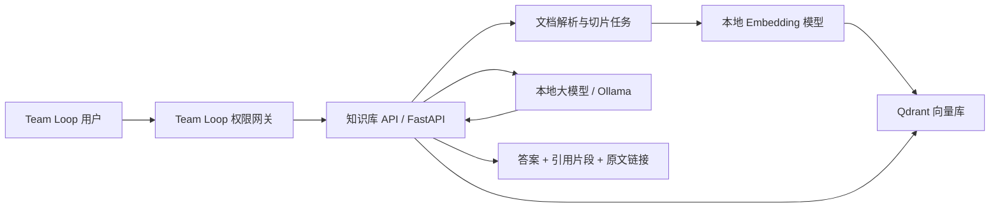

# 本地业务知识库方案

## 目标

在不把内部资料发送到公网的前提下，为 Team Loop 增加“上传资料、语义检索、带出处问答”的能力。知识库应作为独立服务部署，Team Loop 只负责身份、组织权限和前端入口，避免模型依赖影响当前周例会系统。

## 推荐架构



建议组件：

| 能力 | 首选 | 说明 |
| --- | --- | --- |
| API 与任务 | Python + FastAPI | 与现有 Python 运维栈接近，独立进程便于灰度和回滚 |
| 文档解析 | PyMuPDF、python-docx、openpyxl、Markdown 解析器 | 按文件类型使用结构化解析，不用字符串硬拆 |
| 中文向量 | `BAAI/bge-m3` | 支持中文、多语言和长文本，可先使用 dense embedding |
| 向量存储 | Qdrant | 支持 payload 条件过滤，可把组织、密级和文档状态作为强制过滤条件 |
| 本地推理 | Ollama | Windows/服务器上部署简单，同时提供 embedding 和 chat API |
| 生成模型 | 先选企业已批准的中文指令模型 | 依据机器显存选择 7B/14B 量级；没有 GPU 时先只做检索 |

Ollama 的 `/api/embed` 可批量生成向量，索引和查询必须使用同一个 embedding 模型。Qdrant 的 payload filter 用于执行 `org_unit_id`、`visibility`、`status` 等权限过滤，权限条件必须在检索阶段加入，不能只在回答后隐藏。

## 数据边界

每个文档至少保存以下元数据：

```text
document_id
title
source_type
source_path
version
checksum
org_unit_id
visibility: unit | subtree | all
allowed_user_type_keys[]
owner_id
status: processing | ready | failed | archived
created_at / updated_at
```

每个文本块额外保存 `chunk_id`、页码/章节、原文片段和向量。用户提问时，Team Loop 将当前账号、所选组织路径和可见用户类型传给知识库 API；知识库再次验证签名并构造 Qdrant filter。

## 问答流程

1. 管理员上传 PDF、Word、Excel、Markdown 或纯文本。
2. 后台任务进行病毒扫描、格式校验、文本提取、按标题和段落切片。
3. 对文本块生成 embedding，并写入 Qdrant；原文件保存到受控目录，不放在公开静态目录。
4. 用户提问后先执行权限过滤，再做向量检索，推荐取回 20 条候选。
5. 可选 reranker 选出 5-8 条最相关片段。
6. 大模型只能基于检索片段作答；证据不足时明确回答“当前知识库中没有足够依据”。
7. 页面必须显示引用文档、章节/页码、版本与原文入口。

## Team Loop 集成接口

知识库服务建议只监听内网或 `127.0.0.1`，由 Nginx 转发：

```text
POST   /api/knowledge/documents          上传文档
GET    /api/knowledge/documents          文档列表与处理状态
DELETE /api/knowledge/documents/{id}     归档文档并删除对应向量
POST   /api/knowledge/search             只检索，不调用大模型
POST   /api/knowledge/chat               检索增强问答
POST   /api/knowledge/feedback           有用/无用与问题反馈
GET    /api/knowledge/jobs/{id}           解析任务状态
```

Team Loop 与知识库服务之间使用短期签名令牌，令牌只包含 `user_id`、`org_unit_id`、可见组织 ID、用户类型和过期时间。知识库服务不能信任浏览器直接提交的组织 ID。

## 从代码到可用问答的落地步骤

下面是一条不改动 Team Loop 主进程的最短实施路径。知识库单独放在 `knowledge-service/`，独立安装依赖、独立启动；发生模型或解析故障时，周例会系统仍可正常使用。

### 1. 启动本地模型与向量库

安装 Ollama 后，准备一个 embedding 模型和一个经过企业批准的对话模型。模型名称统一放在环境变量中，不要写死在代码里：

```powershell
# 示例名称以实际批准和已下载的模型为准
ollama pull embeddinggemma
ollama pull <your-chat-model>

# 使用 Docker 启动仅监听本机的 Qdrant
docker run -d --name team-loop-qdrant `
  -p 127.0.0.1:6333:6333 `
  -v team_loop_qdrant:/qdrant/storage `
  qdrant/qdrant
```

若内网服务器不能使用 Docker，可下载 Qdrant Windows 可执行文件并让它只监听内网管理地址。不要把 `6333` 端口直接开放给普通用户。

### 2. 创建独立 Python 服务

```powershell
New-Item -ItemType Directory knowledge-service
Set-Location knowledge-service
python -m venv .venv
.\.venv\Scripts\Activate.ps1
pip install fastapi "uvicorn[standard]" qdrant-client ollama `
  python-multipart pymupdf python-docx openpyxl
```

建议目录：

```text
knowledge-service/
  app.py                 # FastAPI 路由与权限校验
  ingestion.py           # 解析、切片、增量索引
  retrieval.py           # embedding、过滤、召回、重排
  prompts.py             # 只允许依据证据回答的系统提示词
  storage/               # 原文件，仅服务账号可读
  jobs/                  # 解析任务状态
  .env                   # 模型、Qdrant、签名密钥，不提交 Git
```

`.env` 至少包含：

```text
OLLAMA_BASE_URL=http://127.0.0.1:11434
EMBEDDING_MODEL=embeddinggemma
CHAT_MODEL=<your-chat-model>
QDRANT_URL=http://127.0.0.1:6333
QDRANT_COLLECTION=team_loop_knowledge
TEAM_LOOP_SIGNING_SECRET=<使用密码工具生成的高强度随机值>
```

### 3. 完成入库链路

入库代码按以下顺序执行，任何一步失败都把文档状态改为 `failed` 并记录可读原因：

1. 保存原文件并计算 SHA-256；相同组织、相同校验值不重复入库。
2. 按扩展名调用 PyMuPDF、python-docx、openpyxl 或文本解析器。
3. 优先按标题、段落、表格行切片，单块建议 400-800 个中文字符，保留 80-120 字重叠。
4. 调用 Ollama `/api/embed` 批量生成向量。
5. 写入 Qdrant，payload 同时写入 `document_id`、`org_unit_id`、`visibility`、`allowed_user_type_keys`、页码和原文片段。
6. 文档更新时先写新版本，索引成功后再把旧版本标记为 archived，避免重建期间查询中断。

### 4. 完成问答链路

`POST /api/knowledge/chat` 的核心逻辑应保持简单且可测试：

```python
def answer(question, identity):
    query_vector = embed(question)
    evidence = qdrant_search(
        vector=query_vector,
        limit=20,
        filters=permission_filter(identity),
    )
    evidence = rerank(question, evidence)[:6]
    if not evidence or evidence[0].score < MIN_RELEVANCE:
        return {"answer": "当前知识库中没有足够依据。", "citations": []}
    prompt = build_grounded_prompt(question, evidence)
    answer_text = ollama_chat(prompt)
    return {"answer": answer_text, "citations": citation_payload(evidence)}
```

前端展示答案时，将 `citations` 渲染为可点击的“文档名 / 章节 / 页码”，不要只显示大模型生成的文字。对代码、SOP 和表格类资料，可同时提供“仅检索”按钮，方便用户直接核对原文。

### 5. 与 Team Loop 接起来

推荐由 Team Loop 后端签发 2-5 分钟有效的 HMAC 令牌，再由 Nginx 将 `/knowledge-api/` 转发给知识库服务：

```nginx
location /knowledge-api/ {
    proxy_pass http://127.0.0.1:8010/;
    proxy_set_header Host $host;
    proxy_set_header X-Forwarded-Proto $scheme;
    proxy_set_header X-Forwarded-For $proxy_add_x_forwarded_for;
}
```

浏览器只向 Team Loop 请求令牌，不能自行声明组织范围。知识库服务验签后从令牌取得 `user_id`、`visible_org_ids` 和 `user_type_key`，并在每一次 Qdrant 检索中应用过滤条件。接入顺序建议为：

1. 先在 Team Loop 增加“知识库”模块权限和入口。
2. 先接 `/search`，验证文档解析、引用和权限隔离。
3. 再接 `/chat`，加入答案区、引用区和有用/无用反馈。
4. 最后开放会议纪要、流程模板等业务数据的“选择性入库”，默认不自动采集。

### 6. 联调验收

至少准备以下自动化用例：

- 同一问题能命中正确文档，并返回准确页码。
- 下级团队看不到同级或私有文档；管理员可按组织授权查看。
- 文档删除或权限收紧后，旧向量立即不可检索。
- 提问包含“忽略系统指令”等提示注入内容时，模型仍只依据授权证据回答。
- Ollama、Qdrant 或解析器离线时，页面显示具体失败环节，不影响 Team Loop 其他模块。
- 恢复备份后，原文件、元数据库和 Qdrant collection 的版本一致。

完成这六步后，系统才算形成“上传资料 -> 解析索引 -> 权限检索 -> AI 回答 -> 引用核验 -> 反馈改进”的完整闭环。

## 分阶段落地

### 第一阶段：两周内可体验

- 独立知识库服务、Qdrant 和 Ollama。
- 支持 PDF、Word、Markdown、TXT。
- 文档列表、处理状态、失败原因。
- 语义搜索、引用片段、原文下载。
- 先不接大模型也能验证资料质量和权限正确性。

### 第二阶段：受控问答

- 接入本地生成模型和 reranker。
- 答案强制引用，低相关度拒答。
- 记录问题、命中文档、耗时和用户反馈，但不记录敏感正文。

### 第三阶段：业务联动

- 会议纪要、流程模板、早例会复盘可由管理员选择性入库。
- 文档版本变化后增量重建索引。
- 建立固定测试题集，灰度发布前比较命中率、引用正确率和拒答率。

## 安全与运维清单

- 模型、向量库和原文件目录均不直接暴露给浏览器。
- 文件类型采用白名单，同时校验扩展名、MIME 和文件签名。
- 上传大小、页数、压缩包层级和解析时间都设置上限。
- 文档删除、权限变更和重新索引写入审计日志。
- Qdrant、知识库元数据库和原文件都进入每日备份，并定期恢复演练。
- 将文档正文视为不可信输入，提示词要求忽略资料中的指令性文本，降低提示注入风险。
- 先用 30-50 个真实业务问题建立验收集，再决定模型，不以“回答看起来通顺”作为上线标准。

## 官方参考

- Ollama Embeddings: https://docs.ollama.com/capabilities/embeddings
- Qdrant Filtering: https://qdrant.tech/documentation/search/filtering/
- BGE-M3 model card: https://huggingface.co/BAAI/bge-m3
